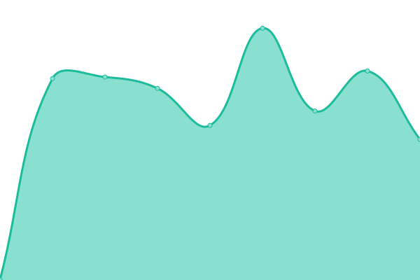
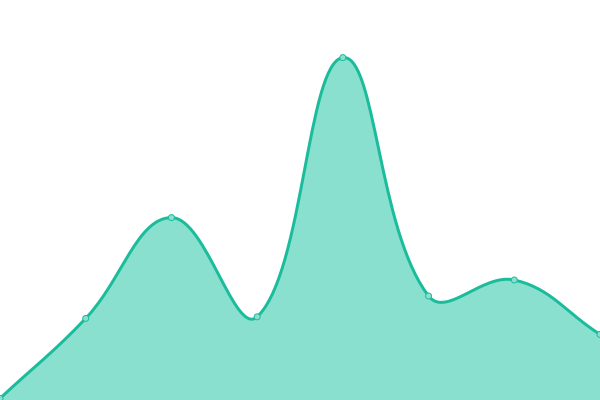
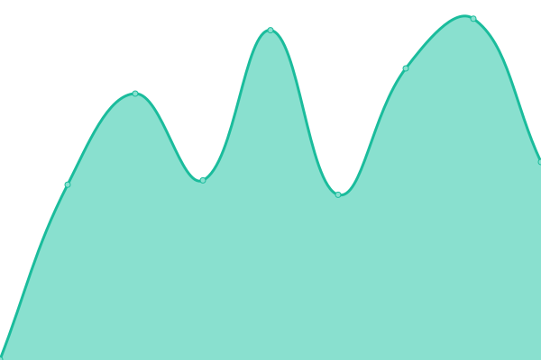
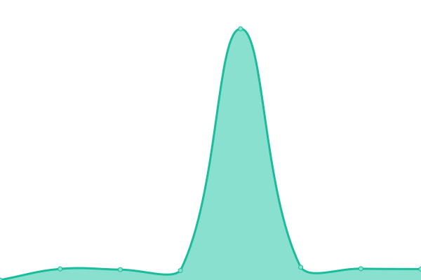
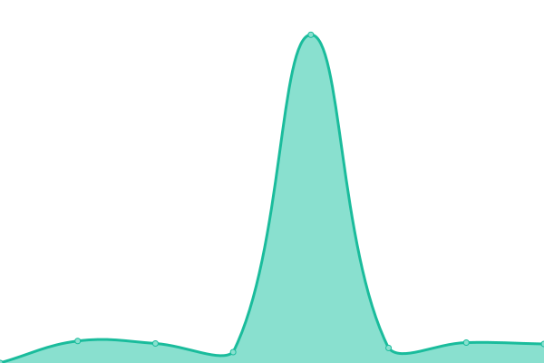
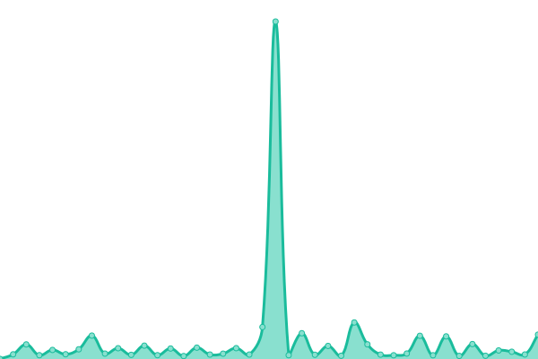
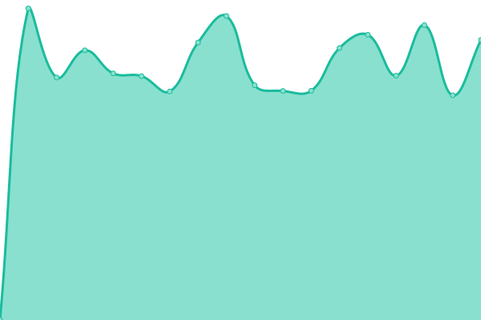
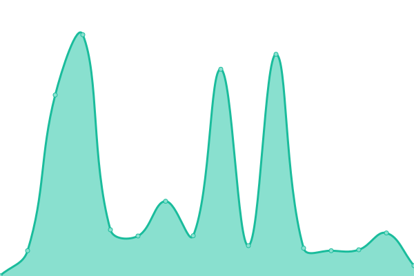
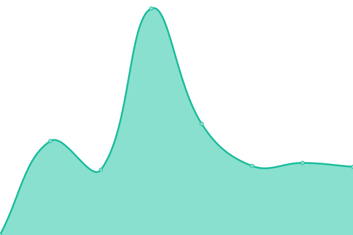

# [📈 Live Status](https://Magic-Services.github.io/Upptime): <!--live status--> **🟧 Partial outage**

This repository contains the open-source uptime monitor and [status page](https://magic-services.github.io/Upptime) for [MagicLike](https://magiclike.github.io), powered by [Upptime](https://github.com/upptime/upptime).

<!--start: status pages-->
<!-- This summary is generated by Upptime (https://github.com/upptime/upptime) -->
<!-- Do not edit this manually, your changes will be overwritten -->
<!-- prettier-ignore -->
| URL | Status | History | Response Time | Uptime |
| --- | ------ | ------- | ------------- | ------ |
|  [MagicLike](https://magiclike.net) | 🟩 Up | [magic-like.yml](https://github.com/Magic-Services/upptime/commits/HEAD/history/magic-like.yml) | 

 980ms
     
 | 

<a href="https://upptime.magiclike.net/history/magic-like">100.00%</a>
    

|  [MagicLike (old)](https://magiclike.codeberg.page) | 🟩 Up | [magic-like-old.yml](https://github.com/Magic-Services/upptime/commits/HEAD/history/magic-like-old.yml) | 

 794ms
     
 | 

<a href="https://upptime.magiclike.net/history/magic-like-old">95.56%</a>
    

|  [MagicLike (old-old)](https://magiclike.github.io) | 🟩 Up | [magic-like-old-old.yml](https://github.com/Magic-Services/upptime/commits/HEAD/history/magic-like-old-old.yml) | 

 120ms
     
 | 

<a href="https://upptime.magiclike.net/history/magic-like-old-old">100.00%</a>
    

|  [Startpage](https://startpage.com) | 🟩 Up | [startpage.yml](https://github.com/Magic-Services/upptime/commits/HEAD/history/startpage.yml) | 

 762ms
     
 | 

<a href="https://upptime.magiclike.net/history/startpage">100.00%</a>
    

|  [DuckDuckGo](https://duckduckgo.com) | 🟩 Up | [duck-duck-go.yml](https://github.com/Magic-Services/upptime/commits/HEAD/history/duck-duck-go.yml) | 

 112ms
     
 | 

<a href="https://upptime.magiclike.net/history/duck-duck-go">98.59%</a>
    

|  [GitHub](https://github.com) | 🟩 Up | [git-hub.yml](https://github.com/Magic-Services/upptime/commits/HEAD/history/git-hub.yml) | 

 321ms
     
 | 

<a href="https://upptime.magiclike.net/history/git-hub">100.00%</a>
    

|  [GitLab](https://gitlab.com) | 🟩 Up | [git-lab.yml](https://github.com/Magic-Services/upptime/commits/HEAD/history/git-lab.yml) | 

 351ms
     
 | 

<a href="https://upptime.magiclike.net/history/git-lab">100.00%</a>
    

|  [Codeberg](https://codeberg.org) | 🟩 Up | [codeberg.yml](https://github.com/Magic-Services/upptime/commits/HEAD/history/codeberg.yml) | 

 632ms
     
 | 

<a href="https://upptime.magiclike.net/history/codeberg">95.61%</a>
    

|  [Codepen](https://codepen.io) | 🟩 Up | [codepen.yml](https://github.com/Magic-Services/upptime/commits/HEAD/history/codepen.yml) | 

 136ms
     
 | 

<a href="https://upptime.magiclike.net/history/codepen">100.00%</a>
    

|  [Mastodon (mstdn.social)](https://mstdn.social) | 🟩 Up | [mastodon-mstdn-social.yml](https://github.com/Magic-Services/upptime/commits/HEAD/history/mastodon-mstdn-social.yml) | 

 924ms
     
 | 

<a href="https://upptime.magiclike.net/history/mastodon-mstdn-social">100.00%</a>
    

|  [Nitter (nitter.net)](https://nitter.net) | 🟩 Up | [nitter-nitter-net.yml](https://github.com/Magic-Services/upptime/commits/HEAD/history/nitter-nitter-net.yml) | 

 558ms
     
 | 

<a href="https://upptime.magiclike.net/history/nitter-nitter-net">99.03%</a>
    

|  [Libreddit (libreddit.spike.codes)](https://libreddit.spike.codes) | 🟥 Down | [libreddit-libreddit-spike-codes.yml](https://github.com/Magic-Services/upptime/commits/HEAD/history/libreddit-libreddit-spike-codes.yml) | 

 0ms
     
 | 

<a href="https://upptime.magiclike.net/history/libreddit-libreddit-spike-codes">100.00%</a>
    

|  [Invidious (invidious.snopyta.org)](https://invidious.snopyta.org) | 🟩 Up | [invidious-invidious-snopyta-org.yml](https://github.com/Magic-Services/upptime/commits/HEAD/history/invidious-invidious-snopyta-org.yml) | 

 1543ms
     
 | 

<a href="https://upptime.magiclike.net/history/invidious-invidious-snopyta-org">100.00%</a>
    

|  [Piped (piped.kavin.rocks)](https://piped.kavin.rocks) | 🟩 Up | [piped-piped-kavin-rocks.yml](https://github.com/Magic-Services/upptime/commits/HEAD/history/piped-piped-kavin-rocks.yml) | 

 210ms
     
 | 

<a href="https://upptime.magiclike.net/history/piped-piped-kavin-rocks">100.00%</a>
    

|  [Peertube (peertube.tv)](https://tube.tchncs.de) | 🟩 Up | [peertube-peertube-tv.yml](https://github.com/Magic-Services/upptime/commits/HEAD/history/peertube-peertube-tv.yml) | 

 1394ms
     
 | 

<a href="https://upptime.magiclike.net/history/peertube-peertube-tv">100.00%</a>
    

|  [Pixelfed](https://pixelfed.org) | 🟩 Up | [pixelfed.yml](https://github.com/Magic-Services/upptime/commits/HEAD/history/pixelfed.yml) | 

 230ms
     
 | 

<a href="https://upptime.magiclike.net/history/pixelfed">100.00%</a>
    

|  [Pixelfed (pixey.org)](https://pixey.org) | 🟩 Up | [pixelfed-pixey-org.yml](https://github.com/Magic-Services/upptime/commits/HEAD/history/pixelfed-pixey-org.yml) | 

 755ms
     
 | 

<a href="https://upptime.magiclike.net/history/pixelfed-pixey-org">100.00%</a>
    

|  [FediDB](https://fedidb.org) | 🟩 Up | [fedi-db.yml](https://github.com/Magic-Services/upptime/commits/HEAD/history/fedi-db.yml) | 

 209ms
     
 | 

<a href="https://upptime.magiclike.net/history/fedi-db">100.00%</a>
    

|  [Ferdium](https://ferdium.org) | 🟩 Up | [ferdium.yml](https://github.com/Magic-Services/upptime/commits/HEAD/history/ferdium.yml) | 

 1119ms
     
 | 

<a href="https://upptime.magiclike.net/history/ferdium">100.00%</a>
    

|  [Liberapay](https://liberapay.com) | 🟩 Up | [liberapay.yml](https://github.com/Magic-Services/upptime/commits/HEAD/history/liberapay.yml) | 

 484ms
     
 | 

<a href="https://upptime.magiclike.net/history/liberapay">100.00%</a>
    

|  [Open Collective](https://opencollective.com) | 🟥 Down | [open-collective.yml](https://github.com/Magic-Services/upptime/commits/HEAD/history/open-collective.yml) | 

 146ms
     
 | 

<a href="https://upptime.magiclike.net/history/open-collective">94.01%</a>
    

|  [Buy Me a Coffe](https://buymeacoffee.com) | 🟩 Up | [buy-me-a-coffe.yml](https://github.com/Magic-Services/upptime/commits/HEAD/history/buy-me-a-coffe.yml) | 

 162ms
     
 | 

<a href="https://upptime.magiclike.net/history/buy-me-a-coffe">100.00%</a>
    

|  [Kutt](https://kutt.it) | 🟩 Up | [kutt.yml](https://github.com/Magic-Services/upptime/commits/HEAD/history/kutt.yml) | 

 321ms
     
 | 

<a href="https://upptime.magiclike.net/history/kutt">19.93%</a>
    

|  umami (instance) | 🟥 Down | [umami-instance.yml](https://github.com/Magic-Services/upptime/commits/HEAD/history/umami-instance.yml) | 

 0ms
     
 | 

<a href="https://upptime.magiclike.net/history/umami-instance">0.00%</a>
    

|  [Shields.io](https://shields.io) | 🟩 Up | [shields-io.yml](https://github.com/Magic-Services/upptime/commits/HEAD/history/shields-io.yml) | 

 134ms
     
 | 

<a href="https://upptime.magiclike.net/history/shields-io">100.00%</a>
    

|  [Crowdin](https://crowdin.com) | 🟩 Up | [crowdin.yml](https://github.com/Magic-Services/upptime/commits/HEAD/history/crowdin.yml) | 

 466ms
     
 | 

<a href="https://upptime.magiclike.net/history/crowdin">100.00%</a>
    

|  [Webblate](https://weblate.org) | 🟩 Up | [webblate.yml](https://github.com/Magic-Services/upptime/commits/HEAD/history/webblate.yml) | 

 1176ms
     
 | 

<a href="https://upptime.magiclike.net/history/webblate">100.00%</a>
    

|  [Webblate (hosted.weblate.org)](https://hosted.weblate.org) | 🟩 Up | [webblate-hosted-weblate-org.yml](https://github.com/Magic-Services/upptime/commits/HEAD/history/webblate-hosted-weblate-org.yml) | 

 5894ms
     
 | 

<a href="https://upptime.magiclike.net/history/webblate-hosted-weblate-org">100.00%</a>
    

|  Nextcloud (semi-public instance) | 🟩 Up | [nextcloud-semi-public-instance.yml](https://github.com/Magic-Services/upptime/commits/HEAD/history/nextcloud-semi-public-instance.yml) | 

 1743ms
     
 | 

<a href="https://upptime.magiclike.net/history/nextcloud-semi-public-instance">100.00%</a>
    

|  [Cryptpad](https://cryptpad.fr) | 🟩 Up | [cryptpad.yml](https://github.com/Magic-Services/upptime/commits/HEAD/history/cryptpad.yml) | 

 573ms
     
 | 

<a href="https://upptime.magiclike.net/history/cryptpad">100.00%</a>
    

|  [Steam](https://store.steampowered.com) | 🟩 Up | [steam.yml](https://github.com/Magic-Services/upptime/commits/HEAD/history/steam.yml) | 

 884ms
     
 | 

<a href="https://upptime.magiclike.net/history/steam">100.00%</a>
    

|  [Steam Community](https://steamcommunity.com) | 🟩 Up | [steam-community.yml](https://github.com/Magic-Services/upptime/commits/HEAD/history/steam-community.yml) | 

 237ms
     
 | 

<a href="https://upptime.magiclike.net/history/steam-community">100.00%</a>
    

|  [SteamDB](https://steamdb.info) | 🟩 Up | [steam-db.yml](https://github.com/Magic-Services/upptime/commits/HEAD/history/steam-db.yml) | 

 179ms
     
 | 

<a href="https://upptime.magiclike.net/history/steam-db">100.00%</a>
    

|  [Epic Games Store](https://epicgames.com) | 🟩 Up | [epic-games-store.yml](https://github.com/Magic-Services/upptime/commits/HEAD/history/epic-games-store.yml) | 

 365ms
     
 | 

<a href="https://upptime.magiclike.net/history/epic-games-store">100.00%</a>
    

|  [itch.io](https://itch.io) | 🟩 Up | [itch-io.yml](https://github.com/Magic-Services/upptime/commits/HEAD/history/itch-io.yml) | 

 193ms
     
 | 

<a href="https://upptime.magiclike.net/history/itch-io">100.00%</a>
    

|  [GOG.com](https://gog.com) | 🟩 Up | [gog-com.yml](https://github.com/Magic-Services/upptime/commits/HEAD/history/gog-com.yml) | 

 2713ms
     
 | 

<a href="https://upptime.magiclike.net/history/gog-com">100.00%</a>
    

|  [Tutanota](https://tutanota.com) | 🟩 Up | [tutanota.yml](https://github.com/Magic-Services/upptime/commits/HEAD/history/tutanota.yml) | 

 1747ms
     
 | 

<a href="https://upptime.magiclike.net/history/tutanota">100.00%</a>
    

|  [Protonmail](https://protonmail.com) | 🟩 Up | [protonmail.yml](https://github.com/Magic-Services/upptime/commits/HEAD/history/protonmail.yml) | 

 1753ms
     
 | 

<a href="https://upptime.magiclike.net/history/protonmail">100.00%</a>
    

|  [Mullvad VPN](https://mullvad.net) | 🟩 Up | [mullvad-vpn.yml](https://github.com/Magic-Services/upptime/commits/HEAD/history/mullvad-vpn.yml) | 

 1313ms
     
 | 

<a href="https://upptime.magiclike.net/history/mullvad-vpn">100.00%</a>
    

|  [Discord](https://discord.com) | 🟩 Up | [discord.yml](https://github.com/Magic-Services/upptime/commits/HEAD/history/discord.yml) | 

 136ms
     
 | 

<a href="https://upptime.magiclike.net/history/discord">100.00%</a>
    

|  [Torproject](https://torproject.org) | 🟩 Up | [torproject.yml](https://github.com/Magic-Services/upptime/commits/HEAD/history/torproject.yml) | 

 912ms
     
 | 

<a href="https://upptime.magiclike.net/history/torproject">100.00%</a>
    

|  [Bitwarden](https://bitwarden.com) | 🟩 Up | [bitwarden.yml](https://github.com/Magic-Services/upptime/commits/HEAD/history/bitwarden.yml) | 

 164ms
     
 | 

<a href="https://upptime.magiclike.net/history/bitwarden">100.00%</a>
    

|  [Folding @ Home](https://foldingathome.org) | 🟩 Up | [folding-home.yml](https://github.com/Magic-Services/upptime/commits/HEAD/history/folding-home.yml) | 

 281ms
     
 | 

<a href="https://upptime.magiclike.net/history/folding-home">100.00%</a>
    

|  [Internet Archive](https://archive.org) | 🟩 Up | [internet-archive.yml](https://github.com/Magic-Services/upptime/commits/HEAD/history/internet-archive.yml) | 

 213ms
     
 | 

<a href="https://upptime.magiclike.net/history/internet-archive">100.00%</a>
    

|  [AlternativeTo](https://alternativeto.net) | 🟩 Up | [alternative-to.yml](https://github.com/Magic-Services/upptime/commits/HEAD/history/alternative-to.yml) | 

 451ms
     
 | 

<a href="https://upptime.magiclike.net/history/alternative-to">100.00%</a>
    

<!--end: status pages-->

[**Visit my status website →**](https://Magic-Services.github.io/Upptime)

## 📄 License

- Powered by: [Upptime](https://github.com/upptime/upptime)
- Code: [MIT](./LICENSE) © [MagicLike Services](https://magiclike.github.io)
- Data in the `./history` directory: [Open Database License](https://opendatacommons.org/licenses/odbl/1-0/)
