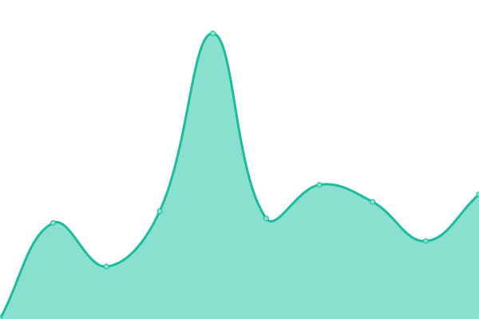
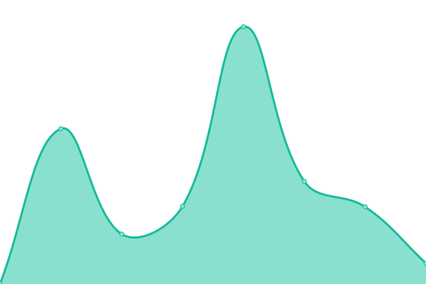

# [📈 Live Status](https://Magic-Services.github.io/Upptime): <!--live status--> **🟧 Partial outage**

This repository contains the open-source uptime monitor and [status page](https://magic-services.github.io/Upptime) for [MagicLike](https://magiclike.github.io), powered by [Upptime](https://github.com/upptime/upptime).

<!--start: status pages-->
<!-- This summary is generated by Upptime (https://github.com/upptime/upptime) -->
<!-- Do not edit this manually, your changes will be overwritten -->
<!-- prettier-ignore -->
| URL | Status | History | Response Time | Uptime |
| --- | ------ | ------- | ------------- | ------ |
|  [MagicLike](https://magiclike.codeberg.page) | 🟩 Up | [magic-like.yml](https://github.com/Magic-Services/upptime/commits/HEAD/history/magic-like.yml) | 

 1928ms
     
 | 

<a href="https://Magic-Services.github.io/upptime/history/magic-like">98.70%</a>
    

|  [MagicLike (old)](https://magiclike.github.io) | 🟩 Up | [magic-like-old.yml](https://github.com/Magic-Services/upptime/commits/HEAD/history/magic-like-old.yml) | 

 85ms
     
 | 

<a href="https://Magic-Services.github.io/upptime/history/magic-like-old">100.00%</a>
    

|  [Startpage](https://startpage.com) | 🟩 Up | [startpage.yml](https://github.com/Magic-Services/upptime/commits/HEAD/history/startpage.yml) | 

 1250ms
     
 | 

<a href="https://Magic-Services.github.io/upptime/history/startpage">100.00%</a>
    

|  [DuckDuckGo](https://duckduckgo.com) | 🟩 Up | [duck-duck-go.yml](https://github.com/Magic-Services/upptime/commits/HEAD/history/duck-duck-go.yml) | 

 119ms
     
 | 

<a href="https://Magic-Services.github.io/upptime/history/duck-duck-go">100.00%</a>
    

|  [GitHub](https://github.com) | 🟥 Down | [git-hub.yml](https://github.com/Magic-Services/upptime/commits/HEAD/history/git-hub.yml) | 

 182ms
     
 | 

<a href="https://Magic-Services.github.io/upptime/history/git-hub">99.99%</a>
    

|  [GitLab](https://gitlab.com) | 🟩 Up | [git-lab.yml](https://github.com/Magic-Services/upptime/commits/HEAD/history/git-lab.yml) | 

 272ms
     
 | 

<a href="https://Magic-Services.github.io/upptime/history/git-lab">100.00%</a>
    

|  [Codeberg](https://codeberg.org) | 🟩 Up | [codeberg.yml](https://github.com/Magic-Services/upptime/commits/HEAD/history/codeberg.yml) | 

 631ms
     
 | 

<a href="https://Magic-Services.github.io/upptime/history/codeberg">99.60%</a>
    

|  [Codepen](https://codepen.io) | 🟩 Up | [codepen.yml](https://github.com/Magic-Services/upptime/commits/HEAD/history/codepen.yml) | 

 89ms
     
 | 

<a href="https://Magic-Services.github.io/upptime/history/codepen">100.00%</a>
    

|  [Mastodon](https://joinmastodon.org) | 🟩 Up | [mastodon.yml](https://github.com/Magic-Services/upptime/commits/HEAD/history/mastodon.yml) | 

 467ms
     
 | 

<a href="https://Magic-Services.github.io/upptime/history/mastodon">100.00%</a>
    

|  [Mastodon (mastodon.social)](https://mastodon.social) | 🟩 Up | [mastodon-mastodon-social.yml](https://github.com/Magic-Services/upptime/commits/HEAD/history/mastodon-mastodon-social.yml) | 

 1990ms
     
 | 

<a href="https://Magic-Services.github.io/upptime/history/mastodon-mastodon-social">100.00%</a>
    

|  [Mastodon (mstdn.social)](https://mstdn.social) | 🟩 Up | [mastodon-mstdn-social.yml](https://github.com/Magic-Services/upptime/commits/HEAD/history/mastodon-mstdn-social.yml) | 

 1234ms
     
 | 

<a href="https://Magic-Services.github.io/upptime/history/mastodon-mstdn-social">100.00%</a>
    

|  [Mastodon (social.tchncs.de)](https://social.tchncs.de) | 🟩 Up | [mastodon-social-tchncs-de.yml](https://github.com/Magic-Services/upptime/commits/HEAD/history/mastodon-social-tchncs-de.yml) | 

 1045ms
     
 | 

<a href="https://Magic-Services.github.io/upptime/history/mastodon-social-tchncs-de">100.00%</a>
    

|  [Nitter (nitter.net)](https://nitter.net) | 🟩 Up | [nitter-nitter-net.yml](https://github.com/Magic-Services/upptime/commits/HEAD/history/nitter-nitter-net.yml) | 

 648ms
     
 | 

<a href="https://Magic-Services.github.io/upptime/history/nitter-nitter-net">100.00%</a>
    

|  [Nitter (nitter.mstdn.social)](https://nitter.mstdn.social) | 🟩 Up | [nitter-nitter-mstdn-social.yml](https://github.com/Magic-Services/upptime/commits/HEAD/history/nitter-nitter-mstdn-social.yml) | 

 1217ms
     
 | 

<a href="https://Magic-Services.github.io/upptime/history/nitter-nitter-mstdn-social">100.00%</a>
    

|  [Libreddit (libreddit.spike.codes)](https://libreddit.spike.codes) | 🟩 Up | [libreddit-libreddit-spike-codes.yml](https://github.com/Magic-Services/upptime/commits/HEAD/history/libreddit-libreddit-spike-codes.yml) | 

 903ms
     
 | 

<a href="https://Magic-Services.github.io/upptime/history/libreddit-libreddit-spike-codes">100.00%</a>
    

|  [Invidious (invidious.snopyta.org)](https://invidious.snopyta.org) | 🟩 Up | [invidious-invidious-snopyta-org.yml](https://github.com/Magic-Services/upptime/commits/HEAD/history/invidious-invidious-snopyta-org.yml) | 

 3137ms
     
 | 

<a href="https://Magic-Services.github.io/upptime/history/invidious-invidious-snopyta-org">100.00%</a>
    

|  [Piped (piped.kavin.rocks)](https://piped.kavin.rocks) | 🟩 Up | [piped-piped-kavin-rocks.yml](https://github.com/Magic-Services/upptime/commits/HEAD/history/piped-piped-kavin-rocks.yml) | 

 323ms
     
 | 

<a href="https://Magic-Services.github.io/upptime/history/piped-piped-kavin-rocks">100.00%</a>
    

|  [Peertube](https://joinpeertube.org) | 🟩 Up | [peertube.yml](https://github.com/Magic-Services/upptime/commits/HEAD/history/peertube.yml) | 

 953ms
     
 | 

<a href="https://Magic-Services.github.io/upptime/history/peertube">100.00%</a>
    

|  [Peertube (tube.tchncs.de)](https://tube.tchncs.de) | 🟩 Up | [peertube-tube-tchncs-de.yml](https://github.com/Magic-Services/upptime/commits/HEAD/history/peertube-tube-tchncs-de.yml) | 

 718ms
     
 | 

<a href="https://Magic-Services.github.io/upptime/history/peertube-tube-tchncs-de">100.00%</a>
    

|  [Pixelfed](https://pixelfed.org) | 🟩 Up | [pixelfed.yml](https://github.com/Magic-Services/upptime/commits/HEAD/history/pixelfed.yml) | 

 282ms
     
 | 

<a href="https://Magic-Services.github.io/upptime/history/pixelfed">100.00%</a>
    

|  [Pixelfed (pixelfed.de)](https://pixelfed.de) | 🟩 Up | [pixelfed-pixelfed-de.yml](https://github.com/Magic-Services/upptime/commits/HEAD/history/pixelfed-pixelfed-de.yml) | 

 786ms
     
 | 

<a href="https://Magic-Services.github.io/upptime/history/pixelfed-pixelfed-de">100.00%</a>
    

|  [Pixelfed (pixel.tchncs.de)](https://pixel.tchncs.de) | 🟩 Up | [pixelfed-pixel-tchncs-de.yml](https://github.com/Magic-Services/upptime/commits/HEAD/history/pixelfed-pixel-tchncs-de.yml) | 

 739ms
     
 | 

<a href="https://Magic-Services.github.io/upptime/history/pixelfed-pixel-tchncs-de">100.00%</a>
    

|  [Pixelfed (pixey.org)](https://pixey.org) | 🟩 Up | [pixelfed-pixey-org.yml](https://github.com/Magic-Services/upptime/commits/HEAD/history/pixelfed-pixey-org.yml) | 

 811ms
     
 | 

<a href="https://Magic-Services.github.io/upptime/history/pixelfed-pixey-org">100.00%</a>
    

|  [Funkwhale](https://funkwhale.audio) | 🟩 Up | [funkwhale.yml](https://github.com/Magic-Services/upptime/commits/HEAD/history/funkwhale.yml) | 

 698ms
     
 | 

<a href="https://Magic-Services.github.io/upptime/history/funkwhale">100.00%</a>
    

|  [Funkwhale (funk.firobe.fr)](https://funk.firobe.fr) | 🟩 Up | [funkwhale-funk-firobe-fr.yml](https://github.com/Magic-Services/upptime/commits/HEAD/history/funkwhale-funk-firobe-fr.yml) | 

 832ms
     
 | 

<a href="https://Magic-Services.github.io/upptime/history/funkwhale-funk-firobe-fr">100.00%</a>
    

|  [tchncs](https://tchncs.de) | 🟩 Up | [tchncs.yml](https://github.com/Magic-Services/upptime/commits/HEAD/history/tchncs.yml) | 

 804ms
     
 | 

<a href="https://Magic-Services.github.io/upptime/history/tchncs">100.00%</a>
    

|  [FediDB](https://fedidb.org) | 🟩 Up | [fedi-db.yml](https://github.com/Magic-Services/upptime/commits/HEAD/history/fedi-db.yml) | 

 267ms
     
 | 

<a href="https://Magic-Services.github.io/upptime/history/fedi-db">100.00%</a>
    

|  [Ferdi](https://getferdi.com) | 🟩 Up | [ferdi.yml](https://github.com/Magic-Services/upptime/commits/HEAD/history/ferdi.yml) | 

 504ms
     
 | 

<a href="https://Magic-Services.github.io/upptime/history/ferdi">100.00%</a>
    

|  [Liberapay](https://liberapay.com) | 🟩 Up | [liberapay.yml](https://github.com/Magic-Services/upptime/commits/HEAD/history/liberapay.yml) | 

 215ms
     
 | 

<a href="https://Magic-Services.github.io/upptime/history/liberapay">99.41%</a>
    

|  [Open Collective](https://opencollective.com) | 🟩 Up | [open-collective.yml](https://github.com/Magic-Services/upptime/commits/HEAD/history/open-collective.yml) | 

 208ms
     
 | 

<a href="https://Magic-Services.github.io/upptime/history/open-collective">100.00%</a>
    

|  [Buy Me a Coffe](https://www.buymeacoffee.com) | 🟩 Up | [buy-me-a-coffe.yml](https://github.com/Magic-Services/upptime/commits/HEAD/history/buy-me-a-coffe.yml) | 

 162ms
     
 | 

<a href="https://Magic-Services.github.io/upptime/history/buy-me-a-coffe">100.00%</a>
    

|  [Kutt](https://kutt.it) | 🟩 Up | [kutt.yml](https://github.com/Magic-Services/upptime/commits/HEAD/history/kutt.yml) | 

 419ms
     
 | 

<a href="https://Magic-Services.github.io/upptime/history/kutt">100.00%</a>
    

|  [umami](https://umami.is) | 🟩 Up | [umami.yml](https://github.com/Magic-Services/upptime/commits/HEAD/history/umami.yml) | 

 287ms
     
 | 

<a href="https://Magic-Services.github.io/upptime/history/umami">100.00%</a>
    

|  [listmonk](https://listmonk.app) | 🟩 Up | [listmonk.yml](https://github.com/Magic-Services/upptime/commits/HEAD/history/listmonk.yml) | 

 165ms
     
 | 

<a href="https://Magic-Services.github.io/upptime/history/listmonk">100.00%</a>
    

|  [Shields.io](https://shields.io) | 🟩 Up | [shields-io.yml](https://github.com/Magic-Services/upptime/commits/HEAD/history/shields-io.yml) | 

 85ms
     
 | 

<a href="https://Magic-Services.github.io/upptime/history/shields-io">100.00%</a>
    

|  [Crowdin](https://crowdin.com) | 🟩 Up | [crowdin.yml](https://github.com/Magic-Services/upptime/commits/HEAD/history/crowdin.yml) | 

 235ms
     
 | 

<a href="https://Magic-Services.github.io/upptime/history/crowdin">100.00%</a>
    

|  [Webblate](https://weblate.org) | 🟩 Up | [webblate.yml](https://github.com/Magic-Services/upptime/commits/HEAD/history/webblate.yml) | 

 803ms
     
 | 

<a href="https://Magic-Services.github.io/upptime/history/webblate">100.00%</a>
    

|  [Nextcloud](https://nextcloud.com) | 🟩 Up | [nextcloud.yml](https://github.com/Magic-Services/upptime/commits/HEAD/history/nextcloud.yml) | 

 901ms
     
 | 

<a href="https://Magic-Services.github.io/upptime/history/nextcloud">100.00%</a>
    

|  [Cryptpad](https://cryptpad.fr) | 🟩 Up | [cryptpad.yml](https://github.com/Magic-Services/upptime/commits/HEAD/history/cryptpad.yml) | 

 784ms
     
 | 

<a href="https://Magic-Services.github.io/upptime/history/cryptpad">100.00%</a>
    

|  [OpenSea](https://opensea.io) | 🟩 Up | [open-sea.yml](https://github.com/Magic-Services/upptime/commits/HEAD/history/open-sea.yml) | 

 100ms
     
 | 

<a href="https://Magic-Services.github.io/upptime/history/open-sea">100.00%</a>
    

|  [Steam](https://store.steampowered.com) | 🟩 Up | [steam.yml](https://github.com/Magic-Services/upptime/commits/HEAD/history/steam.yml) | 

 433ms
     
 | 

<a href="https://Magic-Services.github.io/upptime/history/steam">100.00%</a>
    

|  [Steam Community](https://steamcommunity.com) | 🟩 Up | [steam-community.yml](https://github.com/Magic-Services/upptime/commits/HEAD/history/steam-community.yml) | 

 226ms
     
 | 

<a href="https://Magic-Services.github.io/upptime/history/steam-community">100.00%</a>
    

|  [SteamDB](https://steamdb.info) | 🟩 Up | [steam-db.yml](https://github.com/Magic-Services/upptime/commits/HEAD/history/steam-db.yml) | 

 116ms
     
 | 

<a href="https://Magic-Services.github.io/upptime/history/steam-db">100.00%</a>
    

|  [Epic Games Store](https://epicgames.com) | 🟩 Up | [epic-games-store.yml](https://github.com/Magic-Services/upptime/commits/HEAD/history/epic-games-store.yml) | 

 454ms
     
 | 

<a href="https://Magic-Services.github.io/upptime/history/epic-games-store">100.00%</a>
    

|  [itch.io](https://itch.io) | 🟩 Up | [itch-io.yml](https://github.com/Magic-Services/upptime/commits/HEAD/history/itch-io.yml) | 

 416ms
     
 | 

<a href="https://Magic-Services.github.io/upptime/history/itch-io">100.00%</a>
    

|  [Tutanota](https://tutanota.com) | 🟩 Up | [tutanota.yml](https://github.com/Magic-Services/upptime/commits/HEAD/history/tutanota.yml) | 

 839ms
     
 | 

<a href="https://Magic-Services.github.io/upptime/history/tutanota">100.00%</a>
    

|  [Protonmail](https://protonmail.com) | 🟩 Up | [protonmail.yml](https://github.com/Magic-Services/upptime/commits/HEAD/history/protonmail.yml) | 

 1337ms
     
 | 

<a href="https://Magic-Services.github.io/upptime/history/protonmail">100.00%</a>
    

|  [Protonvpn](https://protonvpn.com) | 🟩 Up | [protonvpn.yml](https://github.com/Magic-Services/upptime/commits/HEAD/history/protonvpn.yml) | 

 631ms
     
 | 

<a href="https://Magic-Services.github.io/upptime/history/protonvpn">100.00%</a>
    

|  [Signal](https://signal.org) | 🟩 Up | [signal.yml](https://github.com/Magic-Services/upptime/commits/HEAD/history/signal.yml) | 

 263ms
     
 | 

<a href="https://Magic-Services.github.io/upptime/history/signal">100.00%</a>
    

|  [Threema](https://threema.ch) | 🟩 Up | [threema.yml](https://github.com/Magic-Services/upptime/commits/HEAD/history/threema.yml) | 

 822ms
     
 | 

<a href="https://Magic-Services.github.io/upptime/history/threema">100.00%</a>
    

|  [Discord](https://discord.com) | 🟩 Up | [discord.yml](https://github.com/Magic-Services/upptime/commits/HEAD/history/discord.yml) | 

 99ms
     
 | 

<a href="https://Magic-Services.github.io/upptime/history/discord">100.00%</a>
    

|  [Matrix](https://matrix.org) | 🟩 Up | [matrix.yml](https://github.com/Magic-Services/upptime/commits/HEAD/history/matrix.yml) | 

 354ms
     
 | 

<a href="https://Magic-Services.github.io/upptime/history/matrix">100.00%</a>
    

|  [Matrix + Element (chat.tchncs.de)](https://chat.tchncs.de) | 🟩 Up | [matrix-element-chat-tchncs-de.yml](https://github.com/Magic-Services/upptime/commits/HEAD/history/matrix-element-chat-tchncs-de.yml) | 

 583ms
     
 | 

<a href="https://Magic-Services.github.io/upptime/history/matrix-element-chat-tchncs-de">100.00%</a>
    

|  [Matrix + Element (chat.mstdn.social)](https://chat.mstdn.social) | 🟩 Up | [matrix-element-chat-mstdn-social.yml](https://github.com/Magic-Services/upptime/commits/HEAD/history/matrix-element-chat-mstdn-social.yml) | 

 547ms
     
 | 

<a href="https://Magic-Services.github.io/upptime/history/matrix-element-chat-mstdn-social">100.00%</a>
    

|  [Rocket.Chat](https://rocket.chat) | 🟩 Up | [rocket-chat.yml](https://github.com/Magic-Services/upptime/commits/HEAD/history/rocket-chat.yml) | 

 643ms
     
 | 

<a href="https://Magic-Services.github.io/upptime/history/rocket-chat">100.00%</a>
    

|  [Session](https://getsession.org) | 🟩 Up | [session.yml](https://github.com/Magic-Services/upptime/commits/HEAD/history/session.yml) | 

 628ms
     
 | 

<a href="https://Magic-Services.github.io/upptime/history/session">100.00%</a>
    

|  [Status](https://status.im) | 🟩 Up | [status.yml](https://github.com/Magic-Services/upptime/commits/HEAD/history/status.yml) | 

 655ms
     
 | 

<a href="https://Magic-Services.github.io/upptime/history/status">96.71%</a>
    

|  [Cwtch](https://cwtch.im) | 🟩 Up | [cwtch.yml](https://github.com/Magic-Services/upptime/commits/HEAD/history/cwtch.yml) | 

 312ms
     
 | 

<a href="https://Magic-Services.github.io/upptime/history/cwtch">100.00%</a>
    

|  [Tor](https://www.torproject.org) | 🟩 Up | [tor.yml](https://github.com/Magic-Services/upptime/commits/HEAD/history/tor.yml) | 

 634ms
     
 | 

<a href="https://Magic-Services.github.io/upptime/history/tor">100.00%</a>
    

|  [Bitwarden](https://bitwarden.com) | 🟩 Up | [bitwarden.yml](https://github.com/Magic-Services/upptime/commits/HEAD/history/bitwarden.yml) | 

 126ms
     
 | 

<a href="https://Magic-Services.github.io/upptime/history/bitwarden">100.00%</a>
    

|  [Unity](https://unity.com) | 🟩 Up | [unity.yml](https://github.com/Magic-Services/upptime/commits/HEAD/history/unity.yml) | 

 684ms
     
 | 

<a href="https://Magic-Services.github.io/upptime/history/unity">99.02%</a>
    

|  [Unreal Engine](https://www.unrealengine.com) | 🟩 Up | [unreal-engine.yml](https://github.com/Magic-Services/upptime/commits/HEAD/history/unreal-engine.yml) | 

 572ms
     
 | 

<a href="https://Magic-Services.github.io/upptime/history/unreal-engine">100.00%</a>
    

|  [Folding @ Home](https://foldingathome.org) | 🟩 Up | [folding-home.yml](https://github.com/Magic-Services/upptime/commits/HEAD/history/folding-home.yml) | 

 348ms
     
 | 

<a href="https://Magic-Services.github.io/upptime/history/folding-home">100.00%</a>
    

|  [Internet Archive](https://archive.org) | 🟩 Up | [internet-archive.yml](https://github.com/Magic-Services/upptime/commits/HEAD/history/internet-archive.yml) | 

 399ms
     
 | 

<a href="https://Magic-Services.github.io/upptime/history/internet-archive">100.00%</a>
    

|  [AlternativeTo](https://alternativeto.net) | 🟩 Up | [alternative-to.yml](https://github.com/Magic-Services/upptime/commits/HEAD/history/alternative-to.yml) | 

 759ms
     
 | 

<a href="https://Magic-Services.github.io/upptime/history/alternative-to">100.00%</a>
    

<!--end: status pages-->

[**Visit my status website →**](https://Magic-Services.github.io/Upptime)

## 📄 License

- Powered by: [Upptime](https://github.com/upptime/upptime)
- Code: [MIT](./LICENSE) © [MagicLike Services](https://magiclike.github.io)
- Data in the `./history` directory: [Open Database License](https://opendatacommons.org/licenses/odbl/1-0/)
